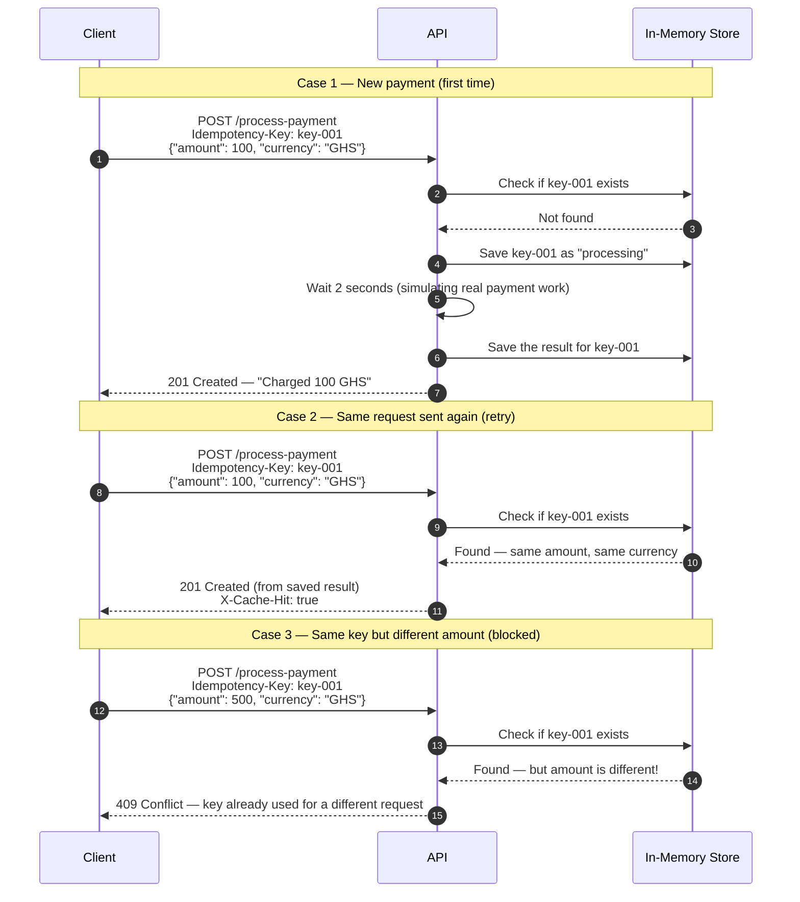

# Idempotency-Gateway (The "Pay-Once" Protocol)

> **Stack:** Python, FastAPI
> **Storage:** In-memory dictionary (no database needed)

---

## 1. What This Project Does

When a customer clicks "Pay", sometimes the internet is slow and the request gets sent more than once. Without any protection, the server processes all of them — and the customer gets charged twice.

This API fixes that. Every payment request comes with a unique ticket number called an `Idempotency-Key`. The server remembers every key it has seen. If the same key comes in again, it just returns the saved result instead of charging again.

---

## 2. Architecture Diagram

This diagram shows what happens in three different situations.



---

## 3. Setup Instructions

### what needed before it runs
- Python 3.11 or higher
- pip

### How to run it

```bash
# 1. Clone the repo and go into the project folder
git clone <your-repo-url>
cd backend/Idempotency-gateway

# 2. Create a virtual environment to keeps dependencies clean
python -m venv venv

# Windows
venv\Scripts\activate

# Mac/Linux
source venv/bin/activate

# 3. Install the required packages
pip install -r requirements.txt

# 4. Start the server
uvicorn app.main:app --reload
```

The server runs at **http://localhost:8000**

All endpoints can be tested visually at **http://localhost:8000/docs**.

---

## 4. API Documentation

### POST `/process-payment`

This is the main endpoint. It takes a payment and an `Idempotency-Key` header.

**Required Headers**

| Header | Description |
|---|---|
| `Idempotency-Key` | A unique string for this payment attempt (e.g. a UUID) |
| `Content-Type` | `application/json` |

**Request Body**

```json
{
  "amount": 100,
  "currency": "GHS"
}
```

- `amount` — must be a number greater than 0
- `currency` — must be exactly 3 letters (e.g. GHS, USD, RWF)

**Possible Responses**

| Status | Situation | Special Header |
|---|---|---|
| `201` | Payment processed for the first time | — |
| `201` | Duplicate request — returned from saved result | `X-Cache-Hit: true` |
| `409` | Same key used with a different amount or currency | — |
| `422` | Request body is missing fields or has wrong types | — |

**Success response**

```json
{
  "status": "success",
  "message": "Charged 100 GHS",
  "transaction_id": "f47ac10b-58cc-4372-a567-0e02b2c3d479",
  "amount": 100.0,
  "currency": "GHS",
  "processed_at": "2025-04-25T10:30:00+00:00"
}
```

**Conflict response**

```json
{
  "detail": "Idempotency key already used for a different request body."
}
```

---

### GET `/health`

Just checks if the server is running.

```json
{ "status": "ok", "service": "idempotency-gateway" }
```

---

## 5. Curl examples

**Send a payment for the first time:**
```bash
curl -X POST http://localhost:8000/process-payment \
  -H "Content-Type: application/json" \
  -H "Idempotency-Key: my-key-001" \
  -d '{"amount": 100, "currency": "GHS"}'
```

**Send the same request again (should come back immediately with same result):**
```bash
curl -X POST http://localhost:8000/process-payment \
  -H "Content-Type: application/json" \
  -H "Idempotency-Key: my-key-001" \
  -d '{"amount": 100, "currency": "GHS"}'
```

**Try changing the amount with the same key (should be rejected):**
```bash
curl -X POST http://localhost:8000/process-payment \
  -H "Content-Type: application/json" \
  -H "Idempotency-Key: my-key-001" \
  -d '{"amount": 500, "currency": "GHS"}'
```

---

### Why FastAPI?

I chose FastAPI because it supports async Python out of the box, which I needed for handling two requests arriving at the same time. It also generates a live testing page at `/docs` automatically, which made development easier.

### How the race condition is handled

If two identical requests arrive at the exact same moment, only one should process. I used `asyncio.Lock()` — each key gets its own lock. The second request waits at the lock until the first one finishes, then reads the saved result instead of starting over.

### How the body is compared

When a key comes in, I create a hash (a short fingerprint) of the request body using SHA-256. If the same key comes in again with a different body, the hashes won't match and the request is rejected. I sort the fields before hashing so the order doesn't matter.

## Key Expiry

**What I added:** Idempotency keys expire after 24 hours.

**Why I added it:** Without expiry, the dictionary grows forever. Old keys from months ago would still be sitting in memory doing nothing. More importantly, a client should be able to reuse a key the next day for a completely new payment — and that would fail if the old result is still saved.

**How it works:** Every saved record stores the time it was created. When a key is looked up, the code checks if it's older than 24 hours. If it is, the record is deleted and the key is treated as brand new.

---

## 8. Project Structure

```
Idempotency-gateway/
├── app/
│   ├── __init__.py       # makes app/ a Python package
│   ├── main.py           # starts the server and registers routes
│   ├── models.py         # defines what a valid request and response look like
│   ├── store.py          # saves and looks up payments, handles locking and expiry
│   └── routes.py         # the actual endpoint logic
├── requirements.txt      # packages needed to run the project
├── .gitignore
└── README.md
```
