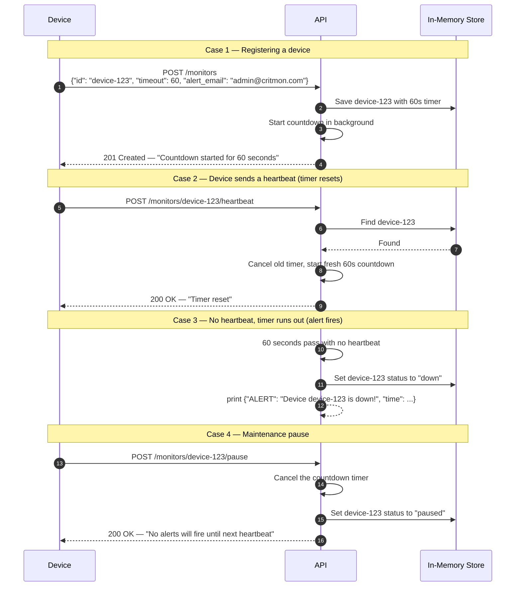

# Pulse-Check-API ("Watchdog" Sentinel)

>> **Stack:** Python, FastAPI
> **Storage:** In-memory dictionary

---

## 1. What This Project Does

Remote devices like solar panels and weather stations are supposed to send an "I'm alive" signal every so often. If a device goes quiet, maybe the power cut out or someone stole it — nobody knows until it's too late.

This API fixes that. When a device registers, a countdown timer starts. The device has to keep sending heartbeats before the timer runs out. If it doesn't, the system fires an alert. It's called a Dead Man's Switch.

---

## 2. Architecture Diagram

This diagram shows the four main things that can happen.



---

## 3. Setup Instructions

- Python 3.11 or higher
- pip

### How to run it

```bash
# 1. Clone the repo and go into the project folder
git clone <your-repo-url>
cd backend/Pulse-Check

# 2. Create a virtual environment
python -m venv venv

# Windows
venv\Scripts\activate

# 3. Install the required packages
pip install -r requirements.txt

# 4. Start the server
uvicorn app.main:app --reload
```

The server runs at **http://localhost:8001**

All endpoints re visually tested at **http://localhost:8000/docs**.

---

## 4. API Documentation

### POST `/monitors`

Register a new device to be monitored.

**Request Body**

```json
{
  "id": "device-123",
  "timeout": 60,
  "alert_email": "admin@critmon.com"
}
```

- `id` — a unique name for the device
- `timeout` — how many seconds before the alert fires if no heartbeat comes
- `alert_email` — who to notify when the device goes down

**Response — 201 Created**

```json
{
  "id": "device-123",
  "status": "active",
  "timeout": 60,
  "alert_email": "admin@critmon.com",
  "message": "Monitor registered. Countdown started for 60 seconds."
}
```

---

### POST `/monitors/{id}/heartbeat`

Reset the countdown for a device. Call this before the timer runs out.

**Response — 200 OK**

```json
{
  "id": "device-123",
  "status": "active",
  "timeout": 60,
  "alert_email": "admin@critmon.com",
  "message": "Heartbeat received. Timer reset."
}
```

**If the device doesn't exist — 404 Not Found**

```json
{
  "detail": "Monitor 'device-123' not found."
}
```

> Sending a heartbeat to a paused device automatically un-pauses it and restarts the timer.

---

### POST `/monitors/{id}/pause`

Stop the countdown without firing an alert. Useful during maintenance.

**Response — 200 OK**

```json
{
  "id": "device-123",
  "status": "paused",
  "timeout": 60,
  "alert_email": "admin@critmon.com",
  "message": "Monitor paused. No alerts will fire until next heartbeat."
}
```

---

### GET `/monitors/{id}`

Check the current status of a device.

**Response — 200 OK**

```json
{
  "id": "device-123",
  "status": "active",
  "timeout": 60,
  "alert_email": "admin@critmon.com"
}
```

Possible status values: `active`, `down`, `paused`

---

### GET `/health`

Checks if the server is running.

```json
{ "status": "ok", "service": "pulse-check" }
```

---

## curl examples

**Register a device:**
```bash
curl -X POST http://localhost:8000/monitors \
  -H "Content-Type: application/json" \
  -d '{"id": "device-123", "timeout": 60, "alert_email": "admin@critmon.com"}'
```

**Send a heartbeat:**
```bash
curl -X POST http://localhost:8000/monitors/device-123/heartbeat
```

**Pause monitoring:**
```bash
curl -X POST http://localhost:8000/monitors/device-123/pause
```

**Check device status:**
```bash
curl http://localhost:8000/monitors/device-123
```

**See the alert fire — register with a short timeout and don't send a heartbeat:**
```bash
curl -X POST http://localhost:8000/monitors \
  -H "Content-Type: application/json" \
  -d '{"id": "test-device", "timeout": 10, "alert_email": "admin@critmon.com"}'
```
Wait 10 seconds, then check your server terminal — you will see the alert printed.

---

### How the timers work

When a device registers, I use `asyncio.create_task()` to start a countdown in the background. The server stays free to handle other requests while the timer runs. When a heartbeat comes in, I cancel the old task and start a new one from zero.

### What happens when the timer runs out

The background task wakes up after the timeout seconds, sets the device status to `down`, and prints a JSON alert to the console.

---

Status Check Endpoint

**What I added:** `GET /monitors/{id}`: lets you check the current status of any device at any time.

**Why I added it:** the only way to knew if a device is down before was to sit and watch the server logs. With it, any script or dashboard can check the status of a device directly whenever it needs to.


---

## 8. Project Structure

```
Pulse-Check/
├── app/
│   ├── __init__.py       # makes app/ a Python package
│   ├── main.py           # starts the server and registers routes
│   ├── models.py         # defines a valid request and response
│   ├── store.py          # saves monitors, runs countdown timers, fires alerts
│   └── routes.py         # endpoints
├── requirements.txt      # dependencies
├── .gitignore
└── README.md
```
